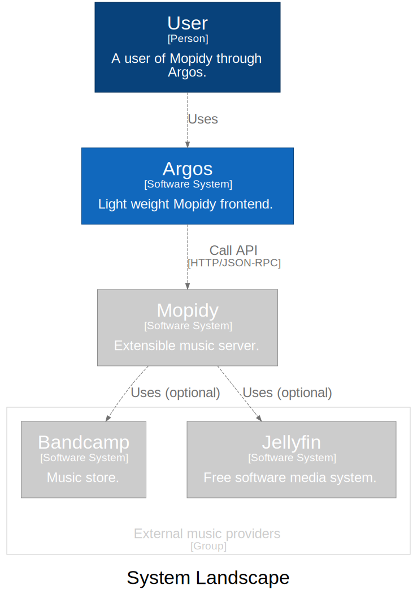
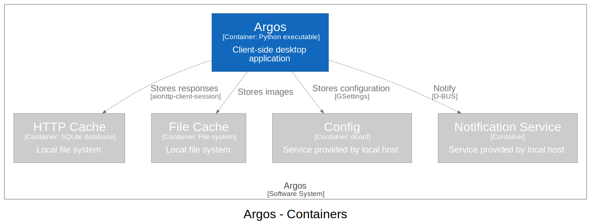
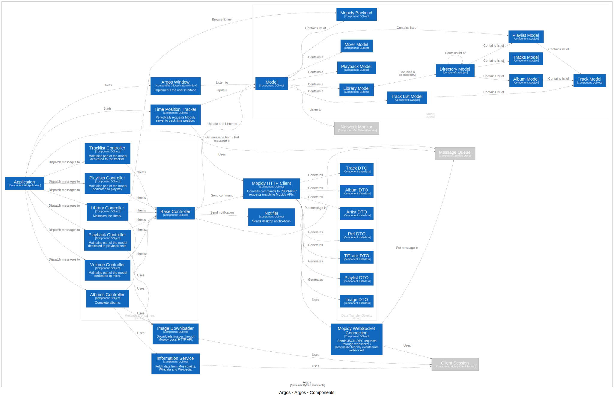

=====================
Contributing to Argos
=====================

One can install dependencies and configure pre-commit hooks in a
dedicated virtual Python environment using ``poetry``::

  $ poetry shell
  $ poetry install
  $ pre-commit install

Pre-commit hooks run ``mypy`` check and make sure code is properly
formatted (using ``black`` and ``isort``).

Build and run from sources using Flatpak
========================================

Clone the source repository, then build and install for current user
(You may have to install the expected runtime, but Flatpak will warn
you about that)::

  $ flatpak-builder --user --install --force-clean builddir io.github.orontee.Argos.json

Then to start the application use your desktop environment launcher,
or from a shell run::

  $ flatpak run io.github.orontee.Argos

Debugging
---------

One can run a shell in sandbox and call the application through
``pdb``::

  $ flatpak run --devel --command=sh io.github.orontee.Argos
  [📦 io.github.orontee.Argos ~]$ python3 -m pdb /app/bin/argos --debug

Build DEB package
=================

To build the DEB package *for a given version*, one can build a Docker
image and export the DEB file from that image::

  $ VERSION=$(poetry version | cut -d' ' -f 2)
  $ git checkout v${VERSION}
  $ docker build -t argos-build:$VERSION --build-arg VERSION=${VERSION} .
  $ docker run --rm -v ${PWD}:/opt/argos argos-build:$VERSION bash -c "cp builddir/*.deb /opt/argos"

To manually build the DEB package *for current HEAD*, first install
the dependencies listed in the `Dockerfile </Dockerfile>`_, then run
the following commands::

  $ VERSION=$(poetry version | cut -d' ' -f 2)
  $ mkdir builddir
  $ git archive --prefix=builddir/argos-${VERSION}/ --format=tar.gz HEAD | tar xzf -
  $ pushd builddir/argos-${VERSION} && debuild -b -tc -us -uc && popd

The corresponding DEB package is generated in the ``builddir`` directory.

Translations
============

To update translation files::

  $ rm -rf builddir
  $ meson builddir && cd builddir
  builddir$ meson compile io.github.orontee.Argos-update-po

Dependencies
============

Runtime dependencies are listed in the file
`generated-poetry-sources.json </generated-poetry-sources.json>`_. It
is generated from ``poetry``'s lock file using `flatpak-builder-tools
<https://github.com/flatpak/flatpak-builder-tools>`_.

Build dependencies are listed in the `Dockerfile </Dockerfile>`_.

Architecture
============

Part of the architecture is documented using `Structurizr DSL
<https://github.com/structurizr/dsl/>`_ and adopt `C4 model
<https://c4model.com/>`_ for visualizing software architecture.

Here is the big picture with Argos surrounded by its users and the
others systems that it interacts with:

Now a high-level technology focussed diagram:

And for developers a components diagram showing their responsibilities
and some technology/implementation details:

Updating architecture diagrams
------------------------------

To validate, export, etc. files using `Structurizr DSL
<https://github.com/structurizr/dsl/>`_, one must uses the
`Structurizr CLI <https://github.com/structurizr/cli/>`_. For example,
to export to SVG format (with Graphviz installed)::

  pushd docs
  docker pull structurizr/cli:latest
  docker run -it --rm -v $PWD:/usr/local/structurizr structurizr/cli export -workspace workspace.dsl -format adot
  for DOT_FILE in *.dot; do dot -Tsvg ${DOT_FILE} -o $(basename ${DOT_FILE} .dot | cut -d'-' -f2-).svg; done
