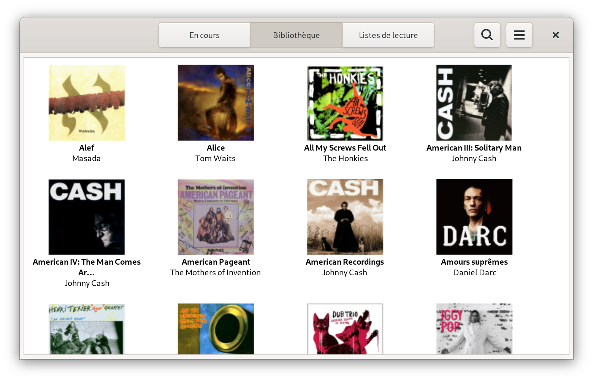

=====
Argos
=====

.. image:: https://img.shields.io/badge/code%20style-black-000000.svg
    :target: https://github.com/psf/black

.. image:: http://www.mypy-lang.org/static/mypy_badge.svg
   :target: http://mypy-lang.org/

Light weight `Mopidy <https://mopidy.com/>`_ front-end.

Argos is designed (and used!) with `Gnome <https://gnome.org>`_ desktop
and small single-board devices with small touchscreen in mind.

.. figure:: screenshot.png
   :alt: Application window screenshot
   :align: center
   :width: 400

   Application window

   Albums view

.. figure:: screenshot-playlists-view.png
   :alt: Playlists view screenshot
   :align: center
   :width: 400

   Playlists view

Features 🥳
===========

* Playback state & tracklist view

* Library browser populated with albums from Mopidy-Local,
  Mopidy-Bandcamp and Mopidy-Podcast

* View and edition of Mopidy-M3U playlists

* Play streams supported by Mopidy-Stream

Consult the `NEWS file </NEWS.rst>`_ for notable changes between
versions.

Install
=======

Platform with Flatpak support
-----------------------------

Clone the source repository, then build and install for current user
(You may have to install the expected runtime, but Flatpak will warn
you about that)::

  $ flatpak-builder --user --install --force-clean builddir io.github.orontee.Argos.json

Then to start the application use your desktop environment launcher,
or from a shell run::

  $ flatpak run io.github.orontee.Argos

Other platform
--------------

``Argos`` was developed to be deployed on a Raspberry Pi Model 2B
(hosting a Mopidy server) running Raspian OS with `LXDE desktop
environment <http://www.lxde.org/>`_. It's a 32-bits beast based on
armv7 and unfortunately there's no chance to have Flatpak support this
architecture according to this ``freedesktop-sdk`` issue:
`Decommissioning armv7
<https://gitlab.com/freedesktop-sdk/freedesktop-sdk/-/issues/1105>`_.

Installation on such platform is currently handled through a DEB
package that can be build using the following (first install the
dependencies listed in the `Dockerfile </Dockerfile>`_ file)::

  $ VERSION=1.1.0
  $ mkdir builddir
  $ git archive --prefix=builddir/argos-${VERSION}/ --format=tar.gz HEAD | tar xzf -
  $ pushd builddir/argos-${VERSION} && debuild -b -tc -us -uc && popd

The corresponding DEB package is generated in the ``builddir`` directory.

Some CLI options are provided to adapt to devices with small touch
screen (complete list can be obtained with ``argos --help``)::

  argos --maximized --no-tooltips --hide-search-button

Configuration
=============

One must set the URL of the Mopidy server using the preferences
dialog. The default value is ``http://127.0.0.1:6680``, meaning Mopidy
server is expected to be listening on the local host using HTTP and
the default 6680 port.

The preferences dialog is accessible from the application menu.

.. figure:: screenshot-preferences.png
   :alt: Preferences dialog
   :align: center
   :width: 200

   Preferences dialog

The URL of the Mopidy server is backed by GSettings. Thus in case the
host has no keyboard, one can directly set the URL of the Mopidy
server through an SSH connection. Make sure changes are done by the
user that will run Argos. Changes can be made using `Dconf Editor
<https://wiki.gnome.org/Apps/DconfEditor>`_ or the command line::

  $ gsettings set io.github.orontee.Argos mopidy-base-url http://192.168.1.45

Debugging
=========

One can run a shell in sandbox and call the application through
``pdb``::

  $ flatpak run --devel --command=sh io.github.orontee.Argos
  [📦 io.github.orontee.Argos ~]$ python3 -m pdb /app/bin/argos --debug

Contributing
============

One can install dependencies and configure pre-commit hooks in a
dedicated virtual environment using ``poetry``::

  $ poetry shell
  $ poetry install
  $ pre-commit install

Pre-commit hooks run ``mypy`` check and make sure code is properly
formatted (using ``black`` and ``isort``).

To update translation files::

  $ rm -rf builddir
  $ meson builddir && cd builddir
  builddir$ meson compile io.github.orontee.Argos-update-po

The file `generated-poetry-sources.json
</generated-poetry-sources.json>`_ is generated from ``poetry``'s lock
file using `flatpak-builder-tools
<https://github.com/flatpak/flatpak-builder-tools>`_.
