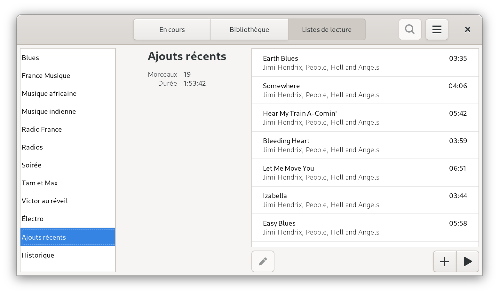

=====
Argos
=====

.. image:: https://img.shields.io/badge/code%20style-black-000000.svg
    :target: https://github.com/psf/black

.. image:: http://www.mypy-lang.org/static/mypy_badge.svg
   :target: http://mypy-lang.org/

Light weight `Mopidy <https://mopidy.com/>`_ front-end.

Argos is designed (and used!) with `Gnome <https://gnome.org>`_ desktop
and small single-board devices with small touchscreen in mind.

.. figure:: screenshot.png
   :alt: Application window screenshot
   :align: center
   :width: 400

   Application window

.. figure:: screenshot-albums-view.png
   :alt: Albums view screenshot
   :align: center
   :width: 400

   Albums view

   Playlists view

Features 🥳
===========

* Playback state & tracklist view

* Library browser populated with Mopidy-Local, Mopidy-Bandcamp and
  Mopidy-Podcast albums

* Playlists view

Install
=======

Platform supporting Flatpak
---------------------------

Clone the source repository, then build and install for current user
(You may have to install the expected runtime, but Flatpak will warn
you about that)::

  $ flatpak-builder --user --install --force-clean builddir app.argos.Argos.json

Then to start the application use your desktop environment launcher,
or from a shell run::

  $ flatpak run app.argos.Argos

Other platform
--------------

``Argos`` was developed to be deployed on a Raspberry Pi Model 2B
(hosting a Mopidy server) running Raspian OS with `LXDE desktop
environment <http://www.lxde.org/>`_. It's a 32-bits beast based on
armv7 and unfortunately there's no chance to have Flatpak support this
architecture according to this ``freedesktop-sdk`` issue:
`Decommissioning armv7
<https://gitlab.com/freedesktop-sdk/freedesktop-sdk/-/issues/1105>`_.

Installation on such platform is currently handled through a DEB
package that can be build using the following (it's recommended to
first install ``build-essential``, ``fakeroot``, ``devscripts`` and
``lintian`` packages)::

  $ VERSION=1.0.0
  $ mkdir builddir
  $ git archive --prefix=builddir/argos-${VERSION}/ --format=tar.gz main | tar xzf -
  $ pushd builddir/argos-${VERSION} && debuild -b -tc -us -uc && popd

The corresponding DEB package is generated in the ``builddir`` directory.

Once the package is installed, it can be automatically started through
a dedicated user (with auto-login configured) using the
``~/.config/lxsession/LXDE-pi/autostart`` file::

  @argos --maximized --no-tooltips

Debugging
=========

One can run a shell in sandbox and call the application through
``pdb``::

  $ flatpak run --devel --command=sh app.argos.Argos
  [📦 app.argos.Argos ~]$ python3 -m pdb /app/bin/argos --debug

Contributing
============

One can install dependencies and configure pre-commit hooks in a
dedicated virtual environment using ``poetry``::

  $ poetry shell
  $ poetry install
  $ pre-commit install

Pre-commit hooks run ``mypy`` check and make sure code is properly
formatted (using ``black``).

To update translation files::

  $ rm -rf builddir
  $ meson builddir && cd builddir
  builddir$ meson compile app.argos.Argos-update-po

The file `generated-poetry-sources.json
</generated-poetry-sources.json>`_ is generated from ``poetry``'s lock
file using `flatpak-builder-tools
<https://github.com/flatpak/flatpak-builder-tools>`_.
