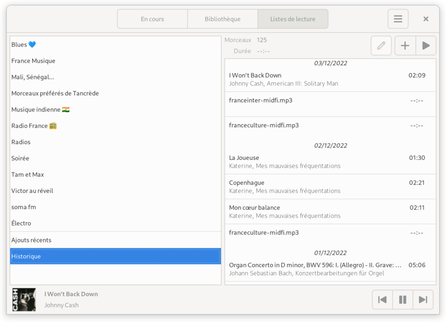
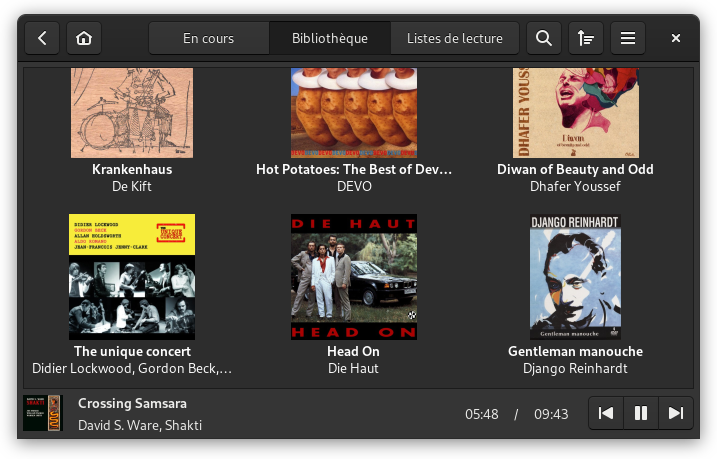
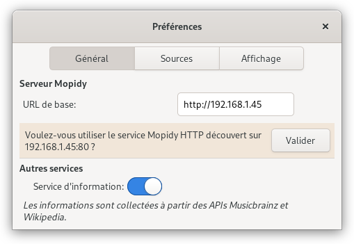

*****
Argos
*****

.. image:: https://img.shields.io/badge/code%20style-black-000000.svg
    :target: https://github.com/psf/black
    :alt: Code style: black

.. image:: https://www.mypy-lang.org/static/mypy_badge.svg
    :target: https://mypy-lang.org/
    :alt: Type check: mypy

.. image:: https://github.com/orontee/argos/actions/workflows/build.yaml/badge.svg
    :target: https://github.com/orontee/argos/actions/workflows/build.yaml
    :alt: CI build status

.. image:: https://img.shields.io/badge/License-GPL--3.0-purple.svg
    :target: https://github.com/orontee/argos/blob/main/LICENSE
    :alt: License: GPL 3.0

.. image:: https://img.shields.io/badge/Store-Flathub-red.svg
    :target: https://flathub.org/fr/apps/io.github.orontee.Argos
    :alt: Store: Flathub

Light weight front-end for `Mopidy <https://mopidy.com/>`_ music server.

Argos is designed (and used!) with `Gnome <https://gnome.org>`_ desktop
and small single-board devices with small touchscreen in mind.

   Application window

   Library view

   Playlists view

   Library view on small screen (800x480) with dark theme

Features 🥳
===========

* Playback state & tracklist view

* Volume control (depending on mixer configuration of Mopidy server)

* Library browser

* View and edition of playlists exposed by Mopidy-M3U

* Play any stream supported by Mopidy-Stream

* Abstracts of album and artist pages on Wikipedia (based on
  Musicbrainz identifiers)

Consult the `NEWS file </NEWS.rst>`_ for notable changes between
versions.

Note that the library is almost agnostic of Mopidy extensions (it has
been reported to successfully give access to resources exposed by
Mopidy-Bandcamp, Mopidy-Local, Mopidy-File, Mopidy-InternetArchive,
Mopidy-Jellyfin, Mopidy-Podcast and Mopidy-SomaFM).

Install
=======

Install using Flatpak
---------------------

Argos can be easily installed on Linux distributions supporting
`Flatpak <https://flatpak.org/>`_::

  $ flatpak install flathub io.github.orontee.Argos
  $ flatpak run io.github.orontee.Argos

Visit `Argos page on Flathub
<https://flathub.org/apps/details/io.github.orontee.Argos>`_ for
detailed instructions.

Install using DEB package
-------------------------

Argos was developed to be deployed on a Raspberry Pi Model 2B (hosting a Mopidy
server) running Raspian OS with `LXDE desktop environment
<http://www.lxde.org/>`_. It's a 32-bits beast based on armv7 and unfortunately
there's no chance to have Flatpak support this architecture according to this
``freedesktop-sdk`` issue: `Decommissioning armv7
<https://gitlab.com/freedesktop-sdk/freedesktop-sdk/-/issues/1105>`_.

Installation on such platform is handled through a DEB package that
can be downloaded from the `Releases page
<https://github.com/orontee/argos/releases>`_::

  $ VERSION=1.13.0
  $ wget https://github.com/orontee/argos/releases/download/v${VERSION}/argos_${VERSION}-1_all.deb
  $ sudo apt install -yf argos_${VERSION}-1_all.deb

It is recommended to install the library `aiohttp-client-cache
<https://aiohttp-client-cache.readthedocs.io/en/latest/index.html>`_
to use a persistent HTTP cache (note that this library isn't available
as DEB package at present time)::

  $ sudo apt install sqlite3
  $ python3 -m pip install aiosqlite aiohttp-client-cache

Running on Windows
------------------

Running Argos on Windows is supported through the `Windows Subsystem for Linux
(WSL) <https://learn.microsoft.com/windows/wsl/>`_.

Make sure WSL 2 is installed with a Debian based distribution. Then simply
follow instructions to `Install using DEB package`_.

Getting help
============

A `Discourse forum <https://discourse.mopidy.com>`_ is dedicated to Mopidy and
its related projects. It's the right place to ask for help.

To report a bug or make a feature request, one must use the `issue tracker
<https://github.com/orontee/argos/issues>`_.

In both places, *courtoisie* reigns; And keep in mind that Mopidy and its
related projects are run by volunteers!

Configuration
=============

One must set the URL of the Mopidy server using the preferences
dialog. The default value is ``http://127.0.0.1:6680``, meaning Mopidy
server is expected to be listening on the local host using HTTP and
the default 6680 port.

The preferences dialog is accessible from the application menu.

   Preferences dialog

The URL of the Mopidy server is backed by GSettings. Thus in case the
host has no keyboard, one can directly set the URL of the Mopidy
server through an SSH connection. Make sure changes are done by the
user that will run Argos. Changes can be made using `Dconf Editor
<https://wiki.gnome.org/Apps/DconfEditor>`_ or the command line::

  $ gsettings set io.github.orontee.Argos mopidy-base-url http://192.168.1.45

Some CLI options are provided (complete list can be obtained with
``argos --help``)::

  $ argos --no-tooltips --hide-search-button

Style
-----

The application is based on `GTK <https://www.gtk.org/>`_ library
which uses CSS for styling and layout.

To adapt to devices with small touch screen one may have to tweak
buttons appearance. Here is an example used to widen some buttons
(to be placed in ``~/.config/gtk-3.0/gtk.css``)::

  #playlist-button-box buttonbox button,
  #album-details-button-box button,
  #condensed-playing-box-playback-controls-box button {
      min-width: 60px;
      min-height: 30px;
  }

Automation
==========

Many actions are exposed through `D-Bus
<https://www.freedesktop.org/wiki/Software/dbus/>`_ and thus available
to script the application. The complete list can be retrieved from a
running instance using::

  $ busctl --user call io.github.orontee.Argos \
                       /io/github/orontee/Argos \
                       org.gtk.Actions DescribeAll

Eg, the following command enables dark theme::

  $ busctl --user call io.github.orontee.Argos \
                       /io/github/orontee/Argos \
                       org.gtk.Actions Activate \
                       "sava{sv}" "enable-dark-theme" 1 b true 0

or to update the directory with URI ``bandcamp:collection`` of
the library::

  $ busctl --user call io.github.orontee.Argos \
                       /io/github/orontee/Argos \
                       org.gtk.Actions Activate \
                       "sava{sv}" "update-library" 1 s "bandcamp:collection" 0

Contributing
============

Instructions to install an unreleased version, debug, etc. can be found
in the `CONTRIBUTING file </CONTRIBUTING.rst>`_.
